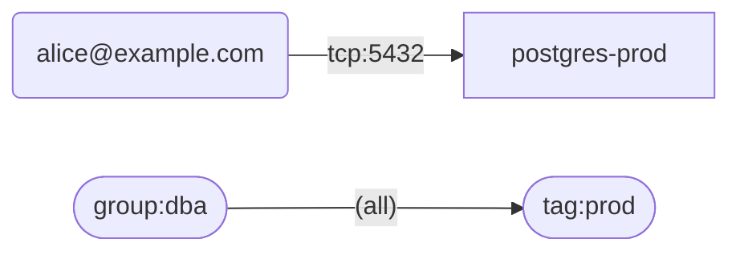

# taildoc

Operational visibility and explainable policy analysis for Tailscale tailnets.

## Why taildoc

Taildoc answers two questions about your tailnet: *what is in it*, and *why does
this access exist?* Every audit finding is explainable — it reports **What**
happened, the raw **Evidence** behind it, **Why** it matters, and a concrete
**Next** step.

- **Local evaluation**: all checks, diffs, and graph rendering run on your machine.
- **Read-only**: taildoc only reads from `api.tailscale.com`. It never modifies your tailnet and never sends your data anywhere else.
- **CI-friendly**: SARIF output, deterministic exit codes, and stable fingerprints for GitHub code scanning.

## Install

**Homebrew-style script install (macOS / Linux):**

The installer verifies a keyless Sigstore signature from this repository's
tag-release workflow. Install [cosign](https://docs.sigstore.dev/cosign/system_config/installation/)
first.

```sh
curl -fsSL https://raw.githubusercontent.com/huza1fa/taildoc/master/install.sh | sh
```

Or download a prebuilt binary directly from the
[releases page](https://github.com/huza1fa/taildoc/releases) — each release ships
`tar.gz` archives (`.zip` on Windows) for linux/darwin/windows on amd64/arm64,
plus a `checksums.txt`.

**With Go:**

```sh
go install github.com/huza1fa/taildoc/cmd/taildoc@latest
```

**Build from source:**

```sh
git clone https://github.com/huza1fa/taildoc && cd taildoc
go build ./cmd/taildoc
```

## Getting started

```sh
taildoc auth login    # interactive: choose API key or OAuth client
taildoc auth status   # verify stored credentials
taildoc inventory     # see your tailnet at a glance
taildoc audit         # run all checks
```

`auth login` prompts you to pick a method:

1. API key — create one at <https://login.tailscale.com/admin/settings/keys> (admin or network admin scope)
2. OAuth client — create one at <https://login.tailscale.com/admin/settings/oauth>

Non-interactive alternative: set `TS_ACCESS_TOKEN` to an API key; taildoc picks it up automatically (see [Credentials](#credentials--security)).

## Commands

| Command | Flags | Description |
|---------|-------|-------------|
| `taildoc inventory` | — | Normalized view: users, groups, devices, tag owners, grants, routers |
| `taildoc audit` | `--output text\|json\|sarif\|markdown`, `--fail-on none\|info\|low\|medium\|high`, `--snapshot file` | Run checks; findings sorted by severity |
| `taildoc explain <src> <dst[:port]>` | — | Trace which grant allows (or denies) access between two resources |
| `taildoc snapshot` | `--output file` | Save the live tailnet as JSON (default: timestamped `taildoc-snapshot-*.json`) |
| `taildoc diff <old.json> [new.json]` | — | Diff two snapshots; omit the second to compare against live |
| `taildoc graph` | `--format mermaid\|dot`, `--output file`, `--snapshot file` | Render grant relationships as a dependency graph |
| `taildoc history` | `--db path` (default `taildoc.db`), `--record` | Findings over time in SQLite; `--record` captures a new run |
| `taildoc auth login` | `--apikey-stdin`, `--oauth-client-id ID --oauth-client-secret-stdin`, `--tailnet NAME` | Store credentials locally after verification |
| `taildoc auth status` | — | Show credential source, method, and verify against the API |
| `taildoc auth logout` | — | Delete the stored credentials file |

Exit codes: `0` success, `1` error, `2` usage error, `3` findings met or exceeded `--fail-on`.

## CI/CD

Gate merges on high-severity findings and publish SARIF results:

```yaml
name: tailnet-audit
on:
  schedule:
    - cron: "0 6 * * 1"
  workflow_dispatch:
jobs:
  audit:
    runs-on: ubuntu-latest
    steps:
      - uses: actions/checkout@11d5960a326750d5838078e36cf38b85af677262 # v4
      - uses: actions/setup-go@40f1582b2485089dde7abd97c1529aa768e1baff # v5
        with:
          go-version: "1.26.6"
      - run: go install github.com/huza1fa/taildoc/cmd/taildoc@v0.2.0
      - name: Audit tailnet
        env:
          TS_ACCESS_TOKEN: ${{ secrets.TS_API_KEY }}
        run: taildoc audit --output sarif > taildoc.sarif || test $? -eq 3
        # ^ keep going on threshold failures so SARIF is still uploaded;
        #   re-check the threshold below for gating
      - name: Enforce severity gate
        env:
          TS_ACCESS_TOKEN: ${{ secrets.TS_API_KEY }}
        run: taildoc audit --fail-on high >/dev/null
      - uses: actions/upload-artifact@ea165f8d65b6e75b540449e92b4886f43607fa02 # v4
        if: always()
        with:
          name: taildoc-sarif
          path: taildoc.sarif
```

To surface findings in GitHub code scanning instead of artifacts, replace the
upload step with `github/codeql-action/upload-sarif@6f5948dfacef28e207b48d0905cf90c03365536d` pointing at `taildoc.sarif`.
Taildoc emits SARIF 2.1.0 with SHA-256 partial fingerprints so repeat findings
deduplicate across runs.

## Example output

`taildoc graph --format mermaid` emits a Mermaid flowchart (users rounded,
groups/tags stadium-shaped, legacy ACL edges dashed):



`taildoc audit --output markdown` starts with a summary heading:

```markdown
# Taildoc Audit Report

Findings: 0 high, 2 medium, 1 low, 3 info (6 total)

## MEDIUM: 2 device(s) with expired node keys

These devices cannot reconnect until their keys are renewed.
...
```

`taildoc diff old.json` prints added/removed/changed lines:

```text
3 change(s): 1 added, 1 removed, 1 changed
  + device web-3 (192.168.1.44)
  - device web-1 — removed from tailnet
  ~ grant group:eng -> tag:staging — ports changed: tcp:443 -> tcp:443,tcp:8443
```

## How findings work

Checks are pure functions of a collected snapshot (`internal/audit`). The nine
checks:

| Check | Looks for |
|-------|-----------|
| stale devices | offline devices unseen for 30+ / 90+ days |
| key expiry | expired keys, keys expiring within 14 days, expiry disabled |
| outdated clients | devices with a Tailscale update available |
| broad grants | wildcard sources/destinations or all-port grants |
| unapproved routes | advertised subnet routes that were never approved |
| single exit node | exactly one advertised exit node (single point of failure) |
| orphaned tags | tags without `tagOwners`, or unused `tagOwners` entries |
| inactive users | suspended users still referenced, users idle 90+ days |
| privileged user devices | user-owned (untagged) devices providing routes |

Each finding carries `Severity`, `Detail` (What), `Evidence`, `Why`, and `Next`.

## Credentials & security

- Stored credentials live at `~/.config/taildoc/config.json` (override with `TAILDOC_CONFIG`), created with directory mode `0700` and file mode `0600`.
- Resolution order: `TS_ACCESS_TOKEN` environment variable first, then the config file.
- Credentials are verified with a read-only call before being saved; rejected credentials are never written to disk.
- Tokens are only ever sent to `api.tailscale.com` (via the official Tailscale SDK). No telemetry, no third-party endpoints.
- `auth login` masks interactive secrets. In automation, pipe one secret to `--apikey-stdin` or `--oauth-client-secret-stdin`; secrets are never accepted as command-line arguments.

## Development

```sh
go test ./...
```

Layout:

| Package | Purpose |
|---------|---------|
| `cmd/taildoc` | binary entry point |
| `internal/cli` | command implementations, usage text, exit-code mapping |
| `internal/collector` | pulls users/devices/policy into a normalized model |
| `internal/tailnet` | normalized tailnet model with lookups |
| `internal/audit` | check functions and text/JSON/SARIF/markdown rendering |
| `internal/policy` | grant evaluation engine used by `explain` |
| `internal/diff` | snapshot comparison |
| `internal/snapshot` | save/load JSON snapshots |
| `internal/graph` | Mermaid and DOT rendering of grant edges |
| `internal/history` | SQLite-backed findings history (via `modernc.org/sqlite`) |
| `internal/auth` | credential storage, resolution, and verification |

## License

MIT — see [LICENSE](LICENSE).
